# oxido-lang

<h2>Developer's Guide</h2>

<h3>
    Introduction</h3>

    1. Parser
    2. Static Checker

The static checker functions to statically check two things : 1) type correctness and 2)ownership-lifetime compatibility. The former is defined under the static semantics common to many programming languages. The only notable point in the static semantics for this Rust subset is that in addition to the usual variable-type binding context, that is, there is a variable mutability context. Essentially, the type checking requires additional information of whether every variable is mutable or immutable, so the environment stores this information.

<h4>Type-Correctness</h4>

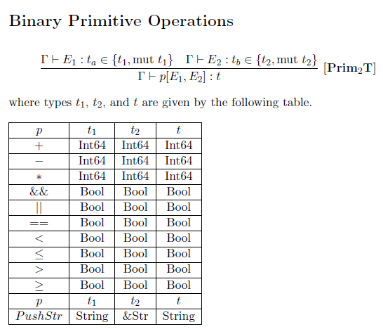

This is so as to support the unique Rust feature of Borrows : either mutably or immutably.

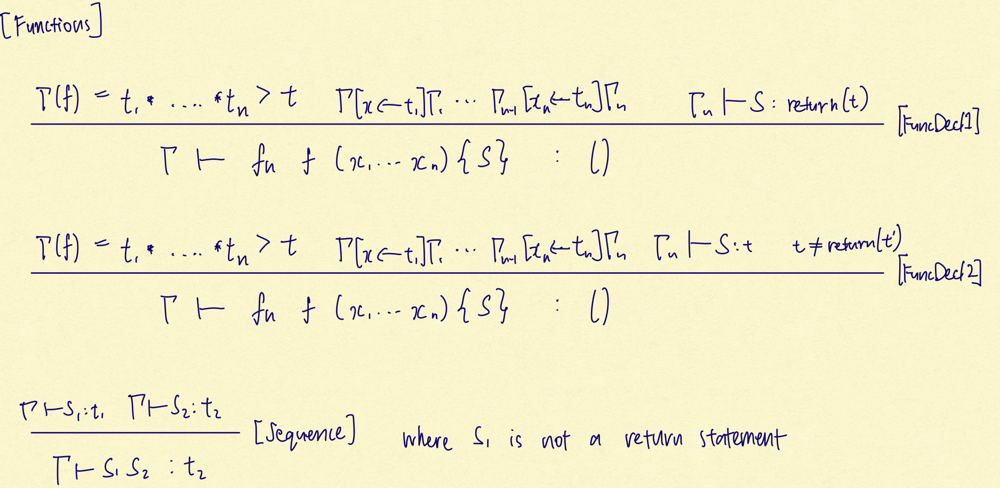

A mutable borrow can only be made to mutable variables (variables, because we restrict the scope of our implementation, explained 3 images under this), while (immutable) borrow can be from anything.

The following shows the static semantics that the type checking ensures (nothing special to Rust).

    
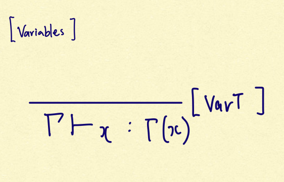

    
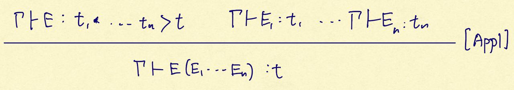

    
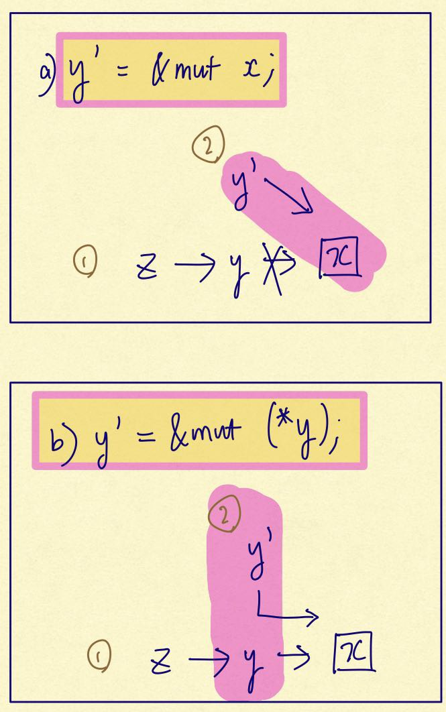

Slightly noteworthy above is the restriction we have made to our scope, such that assignments cannot be made to a borrow or dereference to a non-variable literal.

That is, "let a = & 3;" is not supported, while "let a = 3; let b = &a;" is. 

    
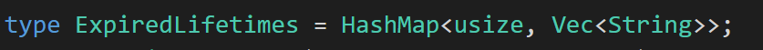

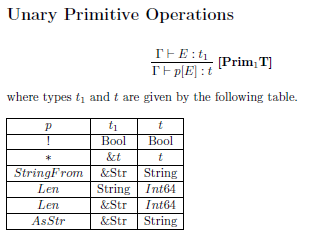

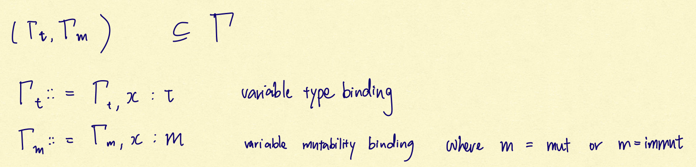

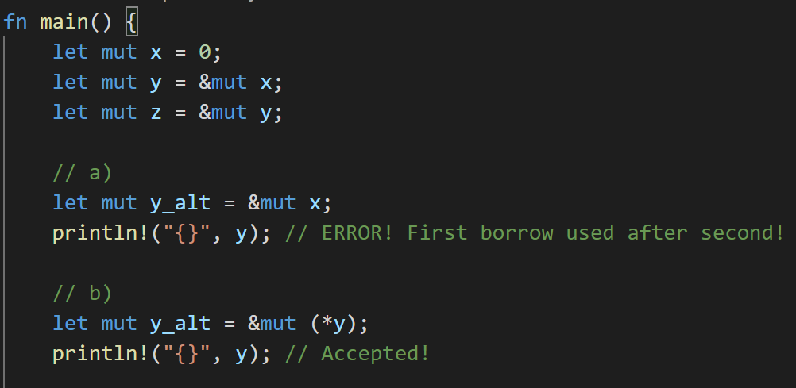

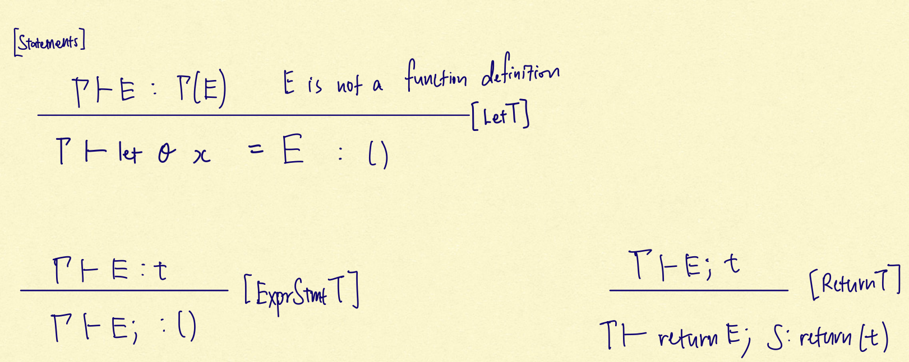

<h4>Ownership-lifetime compatibility (Borrow Checking)</h4>

The speciality of Rust comes in its static checks for ownership-lifetime compatibility. This idea of ownership-lifetime compatibility, as I understand it, translates to the idea that, every pointer to some content, and every other pointer derived from that pointer, can only be used, up till the content is taken back or destroyed.

This means we will not unexpectedly have another variable editing the content at the location. A variable cannot temporarily own, or borrow, (have edit rights to) some location, without some original owner permitting, and a temporary owner (borrower) cannot have others change its content once it takes the content back.

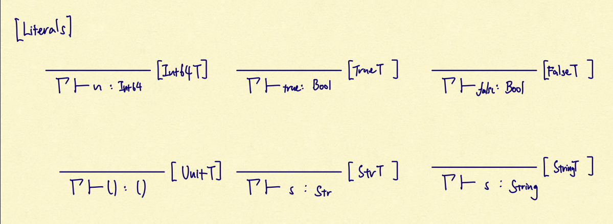

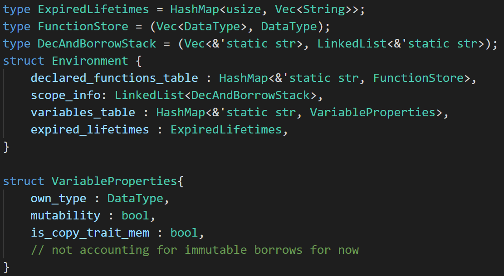

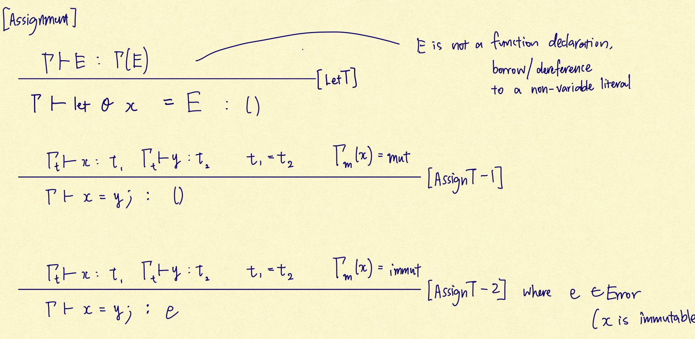

This is partly digression but as one useful implication of such a principle, take the above as an example. So long as we know a and b do not ever refer to the same location, a will remain the same and expectable, regardless of whatever happens in whatever(). As I read, such expectations can allow for greater optimizations in compilers and safety for the user in general. Such an idea is easily supported under the stronger principle mentioned earlier.

Back to the ownership-lifetime compatibility principle, it translates to the following rules

1. A reference and references derived from it, can only be used in its (whatever referred to's) lifetime.
2. A content will not be changed, until the reference gives the content up (i.e. a loan is given up and ownership returns).

This notion of one coming after the other, and the owner taking things back, is effectively showing the one-directional flow of control, out of some prior owner. Hence, this appears to give reason for the use of a stack to maintain this ownership information.

<h4>Implementation</h4>

Ownership-lifetime compatibility checks are done through the creation of stacks at every scope (sub-environment). At the end of every scope, the created stacks are all cleared, unless copied or moved to outside of the scope. As for each stack, they represent every location in memory, to support the earlier explained rules.

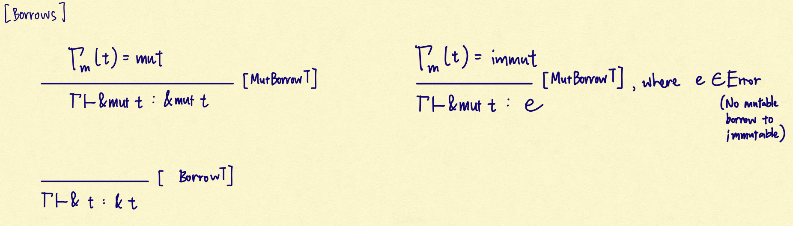

Hence of the environment that supports the whole static checking, it is Environment.scope_info that specifically contains information unique to supporting the ownership-lifetime compatibility checks.

1. Creation of scope

    For every scope, i.e. sequence, the environment is extended. A new DecAndBorrowStack is added to contain the information for that scope.

2. New memory location === Creation of stack

    For every Let expression a variable is set as either a borrower or a first-degree owner to some memory location. 

    A first-degree owner to a location must exist at the bottom of the stack as the root of all borrows to the location, whereas any borrower must come after, i.e. push to the stack. Every use of a variable leads to the claiming back of ownership from the borrowers, hence the stack is popped above whatever variable is used.

3. Borrowing from outer scope \
Every variable declared within the scope is naturally allowed to borrow from whatever came from the earlier, outer scope. Hence, the abovementioned stack, whose purpose is to track the ownership to the memory location initialised in that scope is not sufficient. All variables declared in the scope, including those pointer to older memory locations, must be taken track of. The vector of variable names, ensures this. 
4. Deletion of stack

    At the end of every scope, every declared (and by our restriction, will also have been instantiated) variable must be cleared. \
Every stack is deleted, and every declaration to the outside scope is also popped of the respective stacks of the outer scope.

5. Returning out of stack

    Either at the end or the middle of a sequence, the return statement causes the sequence to terminate, essentially ending the scope (Under our implementation, there is no support for conditionals, so the line-by-line processing until a return statement is met is sufficient). In such cases, before the deletion of stack at 4 occurs, 1. The return variable is checked to be of first-degree, i.e. at the bottom of the stack.

    2. The first-degree variable is given a special name that is unique, and added to the outer-scope. A hidden next line is added such that, if the new stack is of size one, only containing the special-named variable, the new stack, along with the variable name in the list of variable names of the scope, is deleted.  Essentially, the returned variable is forced to have a lifetime of one line; if not moved or copied, it is deleted without assignment to anything.

Output

With the point of the static checker being to 

a) check typed correctness, under the above hand-written rules, and 

b) check ownership-lifetime compatibility,

It's key purpose is to provide the error message when the check fails.

It also provides the compiler with information about when to drop a variable, i.e. when to clear a memory location, which is subsidiary information given the clearing of variables at every scope, and in the line after the scope, if not re-assigned, as explained in 5.  

The static checker returns

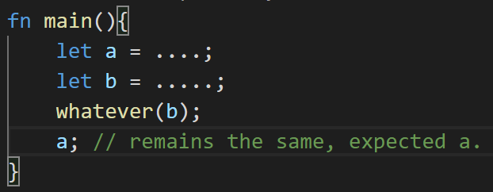

The line after which the variable and the memory it points to must be cleared.

    3. Compiler
    4. VM
